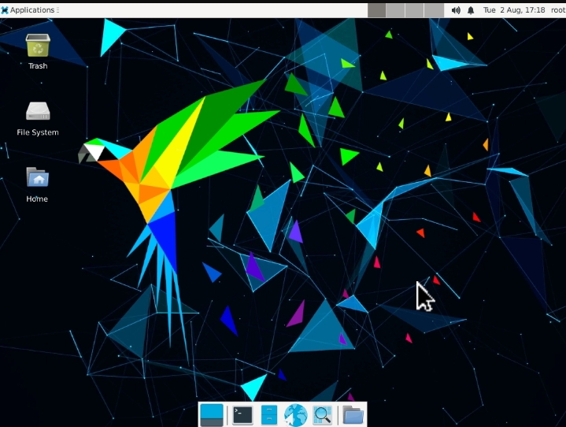

# Termux-parrotOS-x11
Instala parrot os en Entorno gráfico con sus herramientas y programas

<code>bash install.sh</code>

después ejecuta...

<code>./start-parrot.sh</code>

Y ejecutamos el otro archivo parrotOS.sh

<code>bash parrotOS.sh</code>
